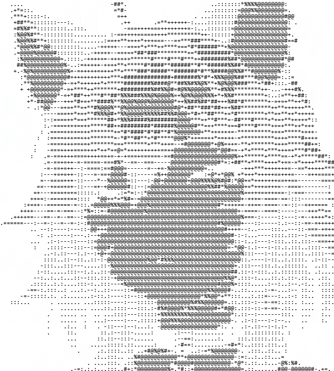

# nekOS

A from-scratch C/XCB/Cairo desktop environment that runs *inside* WSL2
(Void Linux), nested via Xephyr `-glamor` inside WSLg's own
GPU-accelerated session and forwarded straight to a native Windows window —
no VNC viewer, no VM, real GPU rendering. Styled to feel like a real,
cohesive OS: its own window manager, compositor, bar, launcher, file
manager, text editor, settings app, package-manager GUI, notifications, and
a cat that lives on your desktop.



See [FEATURES.md](FEATURES.md) for the full, current feature list (this is
a snapshot of what's actually built, not a roadmap).

Also included, built from source at install time:
- [NekoShot](https://github.com/m0nnnna/NekoShot) — a live system
  snapshot/backup tool, with a native GUI front end (`nekos-shot`).
- [NekoPlayer](https://github.com/m0nnnna/nekoplayer) — a retro
  neko-themed Flutter music player.

## Requirements

- Windows 11, or Windows 10 21H2+ with WSLg support.
- WSL2 with virtualization enabled (the installer will turn this on for you
  if it's off, and may ask for a reboot).
- ~10-15 GB free disk space (most of it is the Flutter SDK build for
  NekoPlayer) and an internet connection — package installs and source
  builds happen on first run, nothing is pre-baked.
- A GPU with a working Windows driver (WSLg's `/dev/dxg` passthrough uses
  it for real hardware-accelerated rendering, including in the browser).

## Install

Open PowerShell and run:

```powershell
irm https://raw.githubusercontent.com/m0nnnna/nekos/master/windows/install.ps1 -OutFile install.ps1
./install.ps1
```

(Download-then-run rather than piping straight into `iex`, so you can read
the script first if you want to.) This will:

1. Check/enable WSL2 and import a clean, official Void Linux base image as
   a new `nekos-void` distro (does not touch any other WSL distro you have).
2. Install the baseline package set (browser, media player, terminal,
   dev toolchain, etc. — see `provision/setup-void.sh` for the exact list).
3. Clone and build nekOS, NekoShot, and NekoPlayer from their public repos.
4. Add a "nekOS" shortcut to your Start Menu.

First run takes a while (mostly the Flutter SDK clone + build for
NekoPlayer) — subsequent launches are fast. Once it's done, launch nekOS
from the Start Menu, or run `windows/launch.ps1` directly.

To update later, just re-run `install.ps1` — it's safe to run again and will
pull + rebuild nekOS and its companion apps instead of reimporting.

## Uninstall

```powershell
wsl --unregister nekos-void
```

This only removes the `nekos-void` WSL distro; nothing else on your system
is touched.

## License

nekOS's own code is MIT-licensed (see [LICENSE](LICENSE)). It bundles/uses
some GPL-3.0 third-party assets (a recolored Bibata cursor theme, Papirus
icons) — see [THIRD_PARTY_NOTICES.md](THIRD_PARTY_NOTICES.md).
